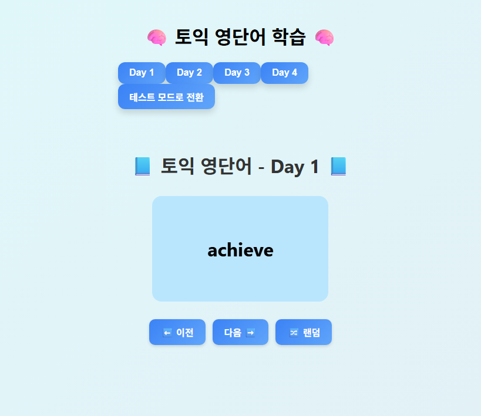
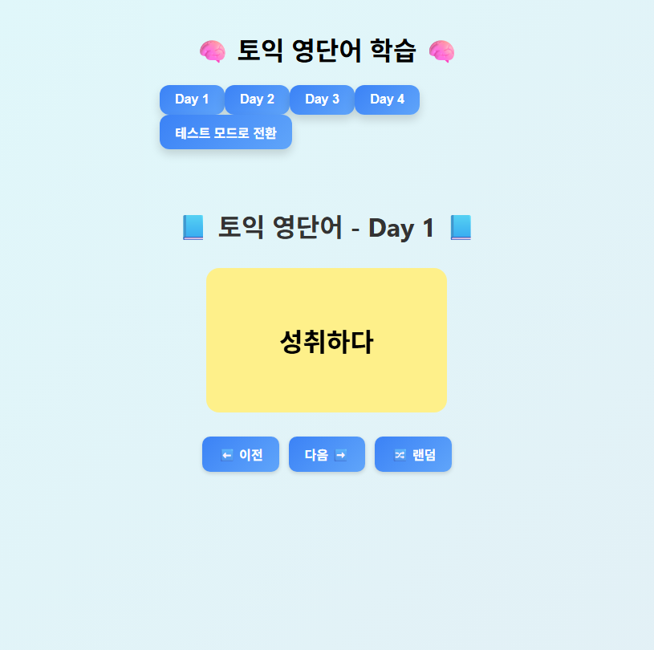
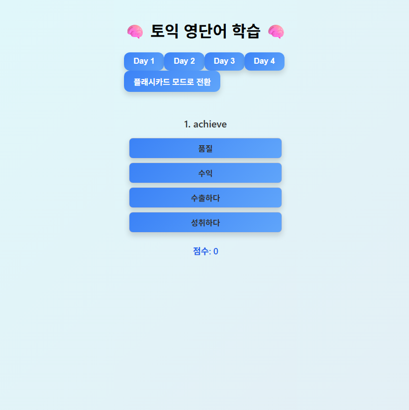

# 토익 단어 외우기 웹 사이트

## 소개
> 토익 단어를 쉽게 외우기 위해 간단한 형태로 제작된 React 웹 사이트

---

## 사용된 기술 스택

    

> react

---

## 페이지 화면

### MainPage

    
     
    

> * flashcard 형태로 단어를 보여줌. 영어 카드를 누르면 회전하며 한국어 뜻이 적힌 카드 뒷면을 보여줌.
> * day 마다 25개씩의 단어를 보여줌줌
> * 이전과 다음을 누르면 다른 단어를 볼 수 있음.
> * 랜덤을 누르면 단어 순서와 상관 없이 랜덤한 위치의 카드를 보여줌
> * 테스트 모드로 전환을 누르면 테스트 모드로 전환 가능

 

### TestMode

    

> * 영어 단어와 객관식 4문제로 한국어 뜻이 나옴.
> * 답을 누르면 점수가 올라가고 연속해서 다른 단어를 테스트할 수 있음.
> * 플래시카드 모드로 전환을 누르면 플래시카드 모드로 전환 가능능